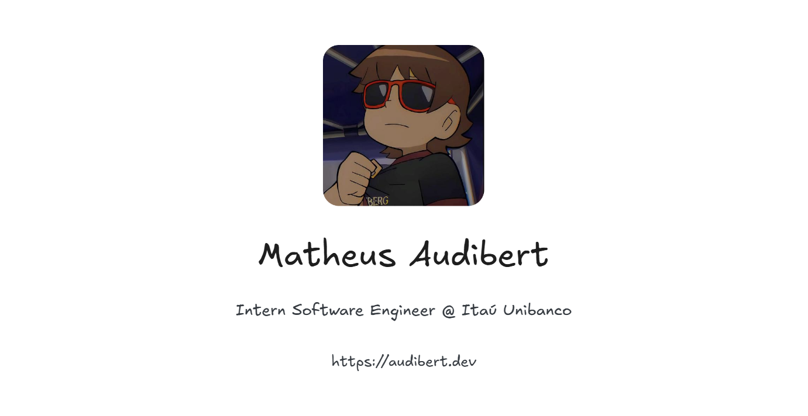

<div align="center">



# yuri

**Um template de portfólio pessoal 100% editável via JSON.**

Sem CMS, sem banco de dados, sem precisar tocar em uma linha de código para editar o conteúdo.
Você edita um arquivo `portfolio.config.json` e escreve seus posts em Markdown — o site cuida do resto.

[🇧🇷 Português](README.md) · 🇺🇸 English *(em breve)*

</div>

---

## O que é isso?

Este repositório é um template de portfólio pessoal, construído para que **qualquer pessoa possa usar como base do próprio site** trocando apenas um arquivo de configuração.

Todo o conteúdo visível no site — nome, foto, bio, experiências profissionais, projetos, habilidades, redes sociais, tema, idioma, até o tamanho da fonte — vem de um único arquivo: [`portfolio.config.json`](portfolio.config.json). O blog funciona à parte, com posts em arquivos `.md` dentro de `src/content/blog/`.

Não é necessário saber programar para manter o site atualizado no dia a dia. Programar só é necessário se você quiser ir além do que o `portfolio.config.json` já oferece.

## ✨ O que o template oferece

- **100% dirigido por JSON** — todo o conteúdo do site vem de `portfolio.config.json`. Edite, salve, pronto.
- **Seções removíveis** — não usa "Projetos"? Não tem certificações? Basta remover (ou colocar `null`) a seção no JSON e ela some do site automaticamente.
- **Blog em Markdown puro** — cada post é um arquivo `.md` com frontmatter simples. Sem CMS, sem painel admin, sem banco de dados.
- **Texto rico em qualquer campo** — `**negrito**`, `*itálico*`, `~~riscado~~`, `` `código` `` e até **links com cor customizada** (`[texto](url){#hex}`) funcionam na bio, nas experiências, nos projetos e no corpo dos posts do blog.
- **Datas de post flexíveis** — escreva a data do post em ISO (`2026-03-31`), por extenso em português (`31 de março de 2026`) ou em inglês (`March 31, 2026`); a ordenação por "mais recente" funciona em qualquer um dos três formatos.
- **Idioma dos títulos de seção** — defina `meta.language` como `"pt"` ou `"en"` e os títulos das seções (Sobre/About, Projetos/Projects, etc.) mudam automaticamente.
- **3 níveis de escala visual** — `small`, `medium` (+25%) e `high` (+50%) aumentam de verdade o tamanho de fontes, ícones e espaçamentos, sem gambiarra de `zoom` do CSS.
- **Tema claro / escuro / sistema**, com botão de troca já incluso.
- **Atividade do Discord ao vivo** — mostra o que você está jogando/ouvindo (via Spotify) em tempo real, com um indicador de status (online/ausente/ocupado/offline) ao lado do seu nome. Totalmente opcional.
- **Limites de exibição automáticos** — coloque quantas redes sociais ou tags quiser no JSON; o site sempre mostra só as primeiras (6 redes sociais, 5 tags por experiência profissional, 3 tags por projeto e por post do blog), sem gerar bagunça visual.
- **Stack moderna**: Next.js 16 (App Router + Turbopack), React 19, TypeScript e Tailwind CSS v4.

## 🚀 Começando

```bash
git clone https://github.com/openportfolios/yuri.git meu-portfolio
cd meu-portfolio
npm install
```

1. Edite o arquivo [`portfolio.config.json`](portfolio.config.json) com as suas informações.
2. (Opcional) Adicione posts de blog em `src/content/blog/*.md`.
3. Rode localmente:

   ```bash
   npm run dev
   ```

4. Acesse `http://localhost:3000` e confira o resultado.
5. Quando estiver satisfeito, publique com `npm run build && npm run start`, ou faça deploy na [Vercel](https://vercel.com) (recomendado, é o que este projeto usa).

## 📖 Documentação completa

Toda a estrutura do `portfolio.config.json`, o sistema de blog, a sintaxe de texto rico e as opções de configuração estão documentadas em detalhes em:

### 👉 [`docs/docs.md`](docs/docs.md)

## 🗺️ Roadmap

Este template está em evolução ativa. Novas seções configuráveis (formação acadêmica, certificações, depoimentos, etc.) e a versão em inglês da documentação estão a caminho.

## 📄 Licença

Distribuído sob a licença [MIT](LICENSE). Use, modifique e publique o seu próprio portfólio à vontade.
