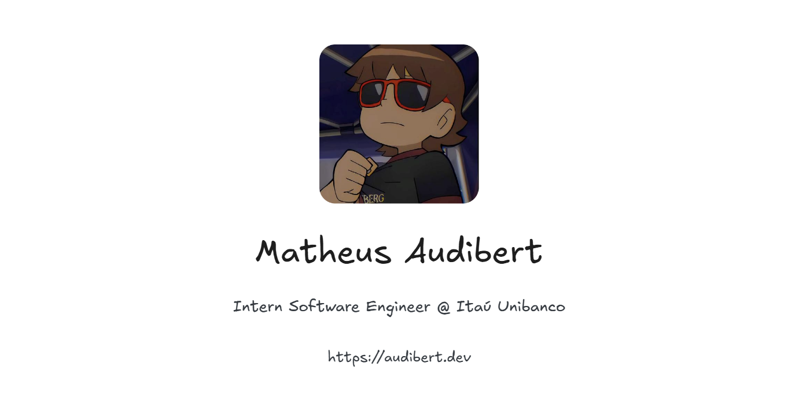

# OpenPortfolios

Template de portfolio pessoal, pronto para usar, construído com [Next.js](https://nextjs.org). Tudo é configurado por um único arquivo (`portfolio.config.json`) e por arquivos Markdown, sem necessidade de programar.



> [!NOTE]
> Este README documenta o projeto. Para a documentação completa de cada campo do `portfolio.config.json` e do sistema de blog, veja [DOCUMENTATION.md](DOCUMENTATION.md).

## Índice

1. [Recursos](#recursos)
2. [Em breve](#em-breve)
3. [Como usar](#como-usar)
4. [Configuração](#configuração)
5. [Rodando localmente](#rodando-localmente)
6. [Estrutura do projeto](#estrutura-do-projeto)
7. [Deploy](#deploy)
8. [Licença](#licença)

## Recursos

- **Configuração via JSON**: cabeçalho, sobre, experiência profissional, formação acadêmica, projetos, habilidades e certificações, tudo editável em `portfolio.config.json`.
- **Seções opcionais e reordenáveis**: qualquer seção pode ser removida (`null`) ou reordenada apenas mudando a posição no arquivo de configuração.
- **Blog embutido**: posts em Markdown dentro de `src/content/blog/`, publicados automaticamente sem precisar registrar nada em outro lugar.
- **Texto rico**: formatação limitada (negrito, itálico, riscado, links coloridos, etc.) nos campos do `portfolio.config.json` e Markdown completo no corpo dos posts do blog.
- **Estrelas do GitHub**: quando o link de um projeto aponta para um repositório público do GitHub, o número de estrelas é exibido automaticamente no card.
- **Atividade do Discord**: exibe em tempo real o que você está jogando/ouvindo no Discord, junto com um indicador de status (online/ausente/ocupado/offline), via [Grux API](https://github.com/matheusaudibert/grux).
- **Temas claro, escuro e automático**, com escala visual ajustável (`small`, `medium`, `high`).
- **Idiomas**: títulos de seção em português ou inglês (`meta.language`).
- **Validação de configuração**: `portfolio.config.json` é validado contra o schema oficial (`@openportfolios/schema`) antes de cada build, com mensagens de erro claras.

## Em breve

- **Imagem de OG gerada automaticamente**: hoje `meta.ogImage` precisa ser uma URL própria; a próxima feature vai gerar essa imagem de prévia automaticamente a partir dos dados do `portfolio.config.json`, sem precisar criar uma imagem manualmente.

## Como usar

Este repositório é um template do GitHub. Para criar o seu portfolio:

1. Clique em **"Use this template"** no topo da página do repositório e crie o seu próprio repositório a partir dele.
2. Ao dar o primeiro `push` na branch `main` do seu repositório, um workflow automático substitui este README por um README simples do seu portfolio e se auto-remove (isso não acontece no repositório original `openportfolios/yuri`).
3. Edite `portfolio.config.json` com as suas informações (veja a seção [Configuração](#configuração)).
4. Publique o projeto (veja [Deploy](#deploy)).

## Configuração

Todo o conteúdo do site é controlado pelo arquivo `portfolio.config.json`, na raiz do projeto. Ele é dividido em blocos, um por seção do site (`meta`, `person`, `about`, `workExperience`, `education`, `projects`, `skills`, `certifications`, `blog`, `discordActivity`).

A documentação completa de cada campo, incluindo como remover e reordenar seções, formatos de texto rico aceitos e como publicar posts no blog, está em [DOCUMENTATION.md](DOCUMENTATION.md).

## Rodando localmente

Pré-requisitos: [Node.js](https://nodejs.org) e npm.

```bash
npm install     # instala as dependências
npm run dev     # inicia o servidor de desenvolvimento em http://localhost:3000
npm run build   # gera a versão de produção (valida o portfolio.config.json antes)
npm run start   # roda a versão de produção já buildada
```

Alterações em `portfolio.config.json` e em posts do blog (`.md`) são refletidas automaticamente pelo servidor de desenvolvimento, sem precisar reiniciar nada.

## Estrutura do projeto

```
├── portfolio.config.json    # configuração do site (edite aqui)
├── scripts/
│   └── validate-config.mjs  # valida portfolio.config.json antes do build
├── src/
│   ├── app/                 # rotas do Next.js (home, blog, preview)
│   ├── components/          # componentes React (cabeçalho, cards, blog, tema, etc.)
│   ├── content/blog/        # posts do blog, um arquivo .md por post
│   └── lib/                 # leitura/validação da config, blog, GitHub, texto rico
└── public/                  # arquivos estáticos (imagens, ícones)
```

## Deploy

Por ser um projeto Next.js padrão, o portfolio pode ser publicado em qualquer plataforma compatível, como a [Vercel](https://vercel.com), bastando importar o repositório e usar as configurações padrão (`npm run build` / `npm run start`).

## Licença

Distribuído sob a licença MIT. Veja [LICENSE](LICENSE) para mais detalhes.
