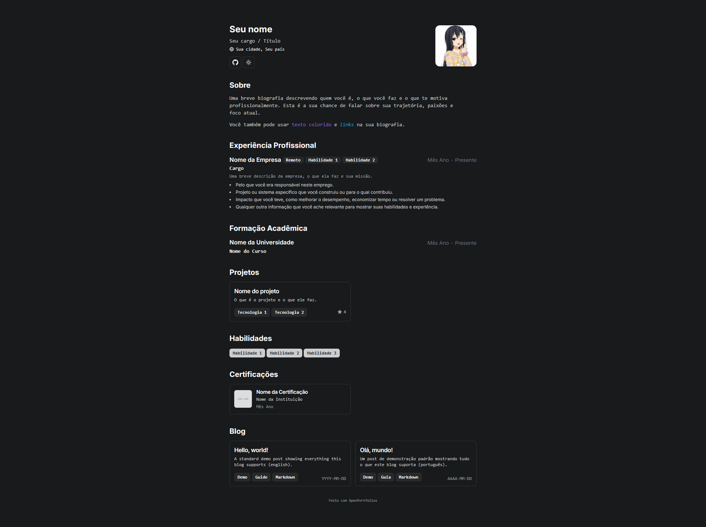

# Template Yuri

Template baseado no portfolio de [Yuri Miguel](https://yuri.dev/) acessível em [openportfolios.com.br/yuri](https://openportfolios.com.br/yuri).

## Como usar

Este repositório é um template do GitHub. Para criar o seu portfolio:

1. Clique em **"Use this template"** no topo da página do repositório e crie o seu próprio repositório a partir dele.
2. Ao dar o primeiro `push` na branch `main` do seu repositório, um workflow automático substitui este README por um README simples do seu portfolio e se auto-remove (isso não acontece no repositório original `openportfolios/yuri`).
3. Edite `portfolio.config.json` com as suas informações (veja a seção [Configuração](#configuração)).
4. Publique o projeto (veja [Deploy](#deploy)).

## Configuração

Todo o conteúdo do site é controlado pelo arquivo `portfolio.config.json`, na raiz do projeto. Ele é dividido em blocos, um por seção do site (`meta`, `person`, `about`, `workExperience`, `education`, `projects`, `skills`, `certifications`, `blog`, `discordActivity`).

A documentação completa de cada campo, incluindo como remover e reordenar seções, formatos de texto rico aceitos e como publicar posts no blog, está em [DOCUMENTACAO.md](DOCUMENTACAO.md).

Distribuído sob a licença MIT. Veja [LICENSE](LICENSE) para mais detalhes.
